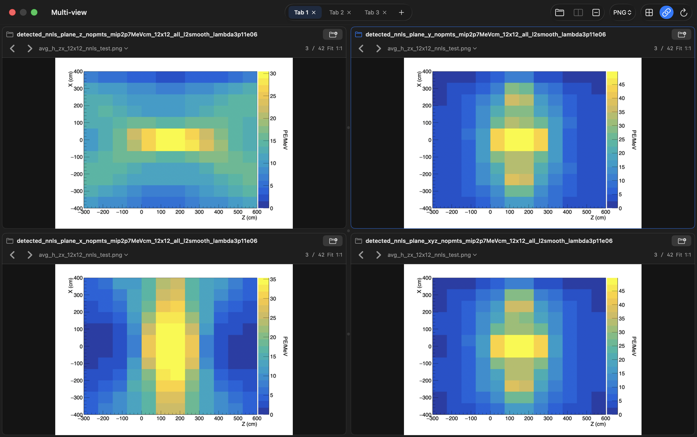

# Multi-view

Multi-view is a native macOS app for comparing images and plots from several folders in one window. It is built with SwiftUI, AppKit, ImageIO, and PDFKit, with no external dependencies or network access.



## Features

- Open up to eight tabs, each with one to four resizable panes. Every tab keeps its own folders, file filter, selected pane, and linked navigation setting.
- Browse a different folder in each pane. Use arrows or the keyboard to move through files, or link navigation to advance populated panes together while preserving their offsets.
- View PNG, JPEG (`.jpg` and `.jpeg`), TIFF (`.tif` and `.tiff`), GIF, SVG, and PDF files. GIFs animate, SVGs stay sharp when zoomed, and multipage PDFs have page controls.
- Filter every pane in a tab by file type or show all supported files. Choose a specific file with the macOS file picker, or drop a folder onto a pane.
- Fit, zoom, and pan images independently. Raster images can display at one image pixel per screen pixel; large rasters load a preview first and fetch full detail when needed.
- Keep source folders untouched. Files are listed in Finder-style filename order; hidden files and subfolders are skipped.

## Install from source

Requires **macOS 14 or later** and Apple Command Line Tools. Install the tools first if needed:

```sh
xcode-select --install
```

Then clone, build, and open the app:

```sh
git clone https://github.com/AlexHeindel/multi-view.git
cd multi-view
./build.sh
open 'build/Multi-view.app'
```

The build script compiles for the current Mac's architecture and ad-hoc signs `build/Multi-view.app`. A full Xcode installation is not required. To keep the app in the Dock, drag it to Applications, launch it from there, and choose **Options → Keep in Dock** from its Dock icon. There is no prebuilt or notarized release at present.

## Use

Choose **Open Folder** in a pane to load images. Click the **+** beside the rightmost tab to add a tab, or use **Add Pane** in the toolbar to compare more folders side by side. The tab strip scrolls horizontally when all tabs do not fit. Click a pane to select it; the selected pane has a blue outline.

Use the **File Type** menu to show one format or **All**. Changing the filter keeps the current file when possible and otherwise selects a file with the same name in the chosen format. **Link Navigation** moves populated panes together and stops when any pane reaches the start or end of its folder.

| Action | Shortcut or gesture |
| --- | --- |
| Previous / next file | Left / Right |
| Next / previous pane | Tab / Shift-Tab |
| Open folder in selected pane | Command-O |
| New tab | Command-N |
| Add pane | Command-T |
| Remove selected pane | Command-Shift-W |
| Toggle linked navigation | Command-L |
| Refresh selected folder | Command-R |
| Fit image to pane | Command-0 |
| Actual size | Command-1 |
| Zoom | Trackpad pinch |
| Pan image | Drag or scroll |

You can drag pane dividers to resize the layout and use **Equalize Panes** to reset it. The **Compare** menu includes **Reveal File in Finder**. PDFs use PDFKit's native 100% scale; raster **1:1** means one image pixel per screen pixel, including on Retina displays.

## Development

Run the checks with `./build.sh test`. An optional large-image stress check is available with `./build.sh stress`; it creates 40,000 hard-linked fixture entries and loads four 49-megapixel images, so it uses substantial memory and disk space. Generated files stay in the ignored `.build/` and `build/` directories.

Folder indexing and image decoding run off the main thread. Raster previews are limited to 1600 pixels on their longest edge, and full-resolution images are requested when zoom requires them. Switching tabs releases decoded images from the hidden tab. Sessions are not saved, and folders are not watched for changes; use **Refresh** to rescan a folder.

## License

[MIT](LICENSE) © 2026 Alex Heindel.
